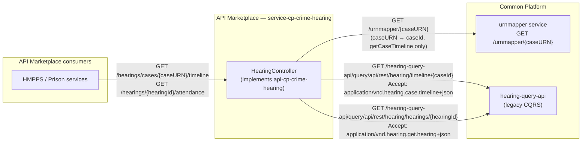
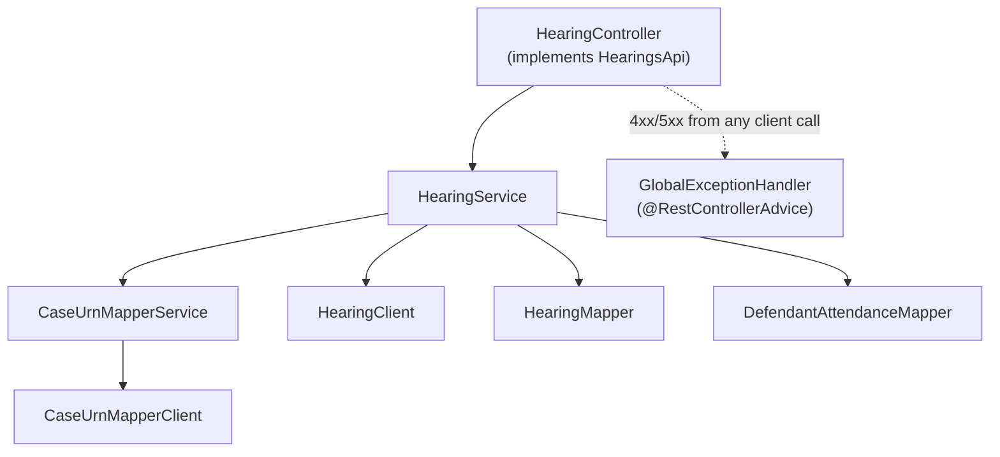
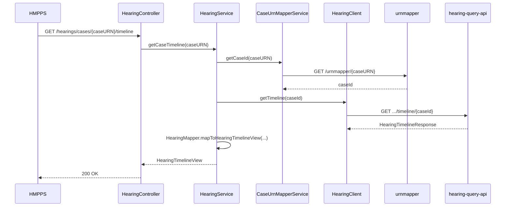
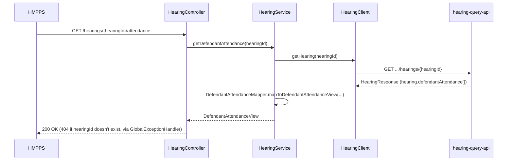

# Architecture — service-cp-crime-hearing

## High-level boundary: API Marketplace ↔ Common Platform hearing domain

`service-cp-crime-hearing` is the API Marketplace (APIM) side of the boundary — a stateless
proxy. It holds no data of its own; every request fans out to Common Platform's legacy CQRS
`hearing-query-api` (and, for `getCaseTimeline`, the `urnmapper` service first). Exact endpoints
shown below.

| Hop | From | To | Endpoint | Media type | Used by |
|---|---|---|---|---|---|
| 1a | `service-cp-crime-hearing` | `urnmapper` | `GET ${AMP_BACKEND_URL}/urnmapper/{caseURN}` | `application/json` | `getCaseTimeline` only |
| 1b | `service-cp-crime-hearing` | `hearing-query-api` | `GET ${CP_BACKEND_URL}/hearing-query-api/query/api/rest/hearing/timeline/{caseId}` | `application/vnd.hearing.case.timeline+json` | `getCaseTimeline` |
| 2 | `service-cp-crime-hearing` | `hearing-query-api` | `GET ${CP_BACKEND_URL}/hearing-query-api/query/api/rest/hearing/hearings/{hearingId}` | `application/vnd.hearing.get.hearing+json` | `getDefendantAttendance`, `resolveDefendantId` (no controller wired yet) |

All hops 1b/2 send a `CJSCPPUID` header for authorization; hop 1a sends none.

## Internal layers

- **Controller** — thin; delegates to `HearingService`, returns `ResponseEntity`. No business logic, no object construction.
- **Service** — orchestrates the client(s) + mapper for each endpoint. Never builds response objects directly.
- **Mapper** — owns all `.builder()` construction. `HearingMapper` for the timeline; `DefendantAttendanceMapper` for attendance — kept separate since they map different domain models from different upstream calls.
- **Client** — `CaseUrnMapperClient` (urnmapper), `HearingClient` (`hearing-query-api`, two methods: `getTimeline`, `getHearing`). No business logic.
- **GlobalExceptionHandler** — catches `HttpClientErrorException`/`HttpServerErrorException` from any client call and maps to the contract's `ErrorResponse`; this is how a 404 from either upstream hop becomes a 404 to the API consumer, with no per-endpoint error-handling code.

## Sequence — `getCaseTimeline` (two-hop)

## Sequence — `getDefendantAttendance` (single-hop)

`resolveDefendantId(hearingId, masterDefendantId, caseURN)` reuses the same `HearingClient.getHearing`
call and `HearingResponse` DTO, reading `hearing.prosecutionCases[].defendants[]` instead of
`hearing.defendantAttendance[]` — no second HTTP call. It has no controller wired to it yet; it's
infrastructure for the future `getDefendants` endpoint.
